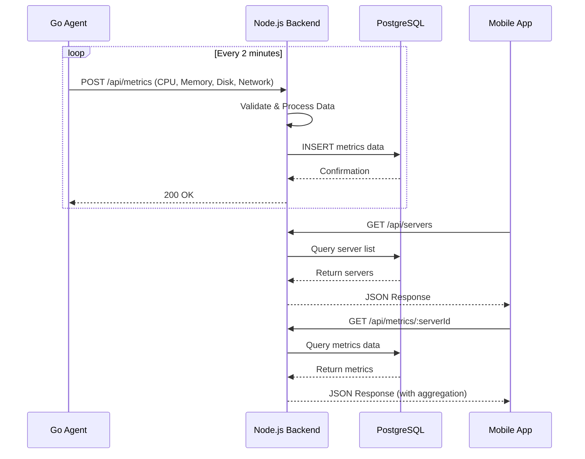

# Server Monitoring System - Backend

A robust, real-time server monitoring solution built with Node.js and TypeScript that provides comprehensive infrastructure visibility through automated data collection and centralized processing.

## Table of Contents

- [Overview](#overview)
- [System Architecture](#system-architecture)
- [Features](#features)
- [Technology Stack](#technology-stack)
- [Performance & Scalability](#performance--scalability)

## 🎯 Overview

This backend service acts as the central processing hub for a distributed server monitoring system. It receives metrics from lightweight Go agents deployed across multiple servers, processes and stores this data efficiently, and exposes REST APIs for real-time mobile app consumption.

### Key Capabilities

- **Real-time Monitoring**: Collect server metrics every 2 minutes
- **Centralized Processing**: Single backend handling multiple server agents
- **Persistent Storage**: PostgreSQL database for reliable data retention
- **Mobile-First API**: Optimized endpoints for mobile app consumption
- **Scalable Architecture**: Designed to handle hundreds of concurrent agents

## System Architecture

### High-Level Architecture

```
┌─────────────────┐         ┌──────────────────────┐         ┌─────────────────┐
│   Go Agent      │────────▶│  Node.js Backend     │────────▶│   PostgreSQL    │
│ (Server 1)      │         │  (TypeScript)        │         │   Database      │
│ Interval: 2min  │         │                      │         │                 │
└─────────────────┘         │  - Data Validation   │         └─────────────────┘
                            │  - Processing        │                  │
┌─────────────────┐         │  - API Endpoints     │                  │
│   Go Agent      │────────▶│  - Authentication    │                  │
│ (Server 2)      │         │                      │                  │
└─────────────────┘         └──────────────────────┘                  │
                                       │                              │
┌─────────────────┐                    │                              │
│   Go Agent      │────────────────────┘                              │
│ (Server N)      │                                                   │
└─────────────────┘                                                   │
                                                                      │
                            ┌──────────────────────┐                  │
                            │   Mobile App         │◀─────────────────┘
                            │   (REST Client)      │
                            └──────────────────────┘
```

### Data Flow Diagram



## Features

### Core Functionality

- **Metric Collection**
  - CPU usage (%, cores, load average)
  - Memory utilization (total, used, free, cached)
  - Disk I/O and space metrics
  - Network bandwidth and packet statistics
  - Process monitoring
  - System uptime and boot time

- **Data Management**
  - Efficient time-series data storage
  - Data aggregation and rollup strategies
  - Automatic data retention policies
  - Query optimization for large datasets

- **API Services**
  - RESTful API design
  - Real-time metric retrieval
  - Historical data analysis
  - Server health status endpoints
  - Alert threshold configuration

- **Mobile Optimization**
  - Lightweight JSON payloads
  - Data pagination
  - Response caching
  - Bandwidth-efficient queries

## Technology Stack

### Backend

- **Runtime**: Node.js 18+ LTS
- **Language**: TypeScript 5.x
- **Framework**: Express.js
- **Database**: PostgreSQL 15+
- **ORM**: Prisma / TypeORM
- **Validation**: Zod / Joi
- **Authentication**: JWT

### DevOps & Tools

- **Package Manager**: npm / yarn / pnpm
- **Testing**: Jest, Supertest
- **Code Quality**: ESLint, Prettier
- **Documentation**: TypeDoc
- **Monitoring**: Winston (logging)

## Performance & Scalability

### Optimization Techniques

1. **Database Indexing**
   - Compound indexes on (server_id, timestamp)
   - Partial indexes for active servers
   - Time-series partitioning for large datasets

2. **Connection Pooling**
   - Connection reuse and lifecycle management

3. **Data Retention**
   - Automated cleanup jobs
   - Tiered storage strategy
   - Archive old data to cold storage

4. **Query Optimization**
   - Prepared statements
   - Batch inserts for metrics
   - Pagination for large result sets

### Horizontal Scaling

```
                    ┌──────────────┐
                    │ Load Balancer│
                    └──────┬───────┘
                           │
         ┌─────────────────┼─────────────────┐
         │                 │                 │
    ┌────▼────┐       ┌────▼────┐      ┌────▼────┐
    │Backend 1│       │Backend 2│      │Backend 3│
    └────┬────┘       └────┬────┘      └────┬────┘
         │                 │                 │
         └─────────────────┼─────────────────┘
                           │
                    ┌──────▼───────┐
                    │  PostgreSQL  │
                    │  (Primary)   │
                    └──────┬───────┘
                           │
                    ┌──────▼───────┐
                    │  PostgreSQL  │
                    │  (Replica)   │
                    └──────────────┘
```

**Built with ❤️**

For questions or support, please open an issue or contact [your-email@example.com](mailto:aaryanmeena96@example.com)